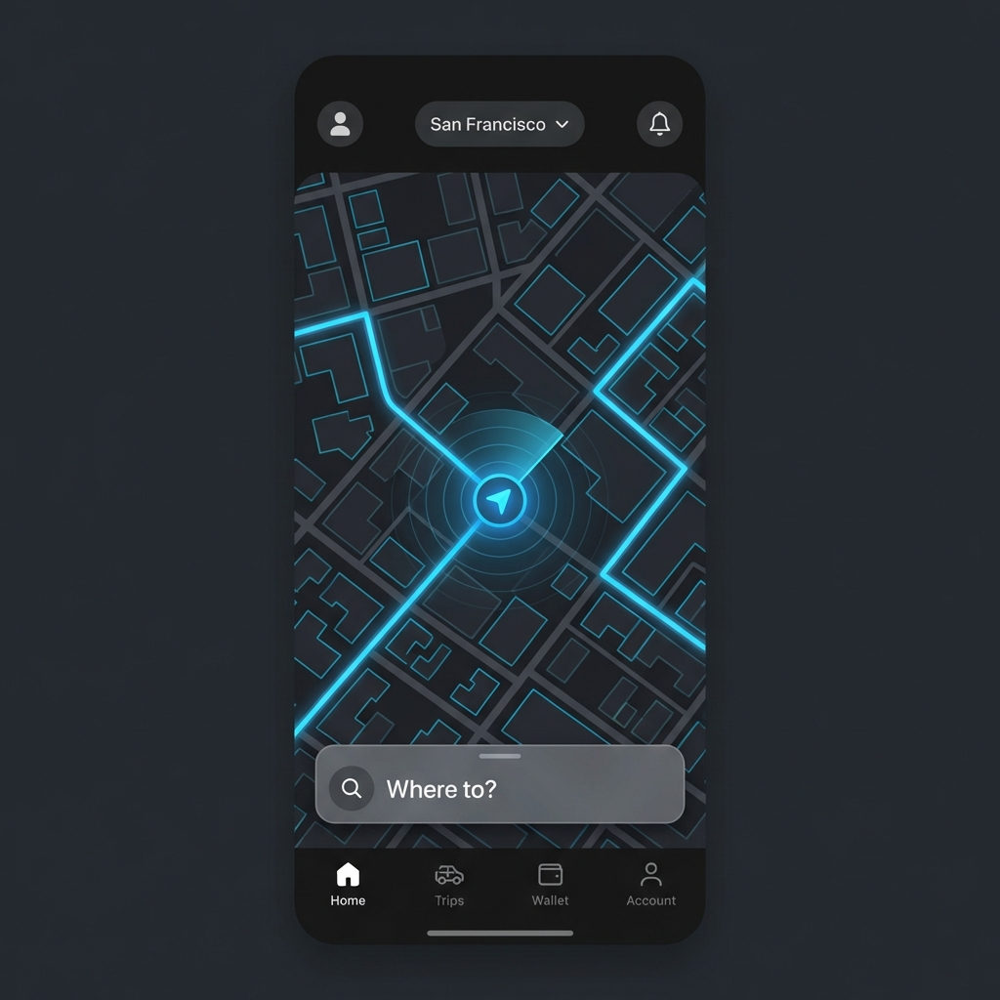
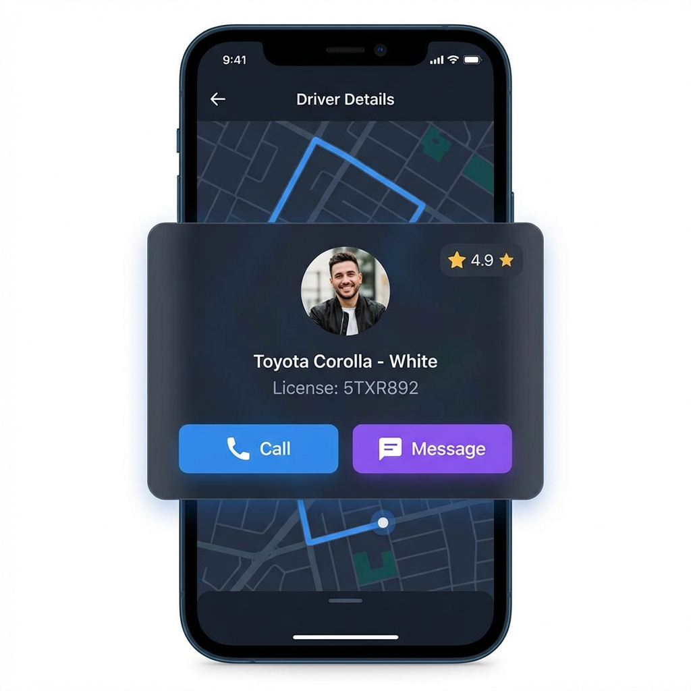
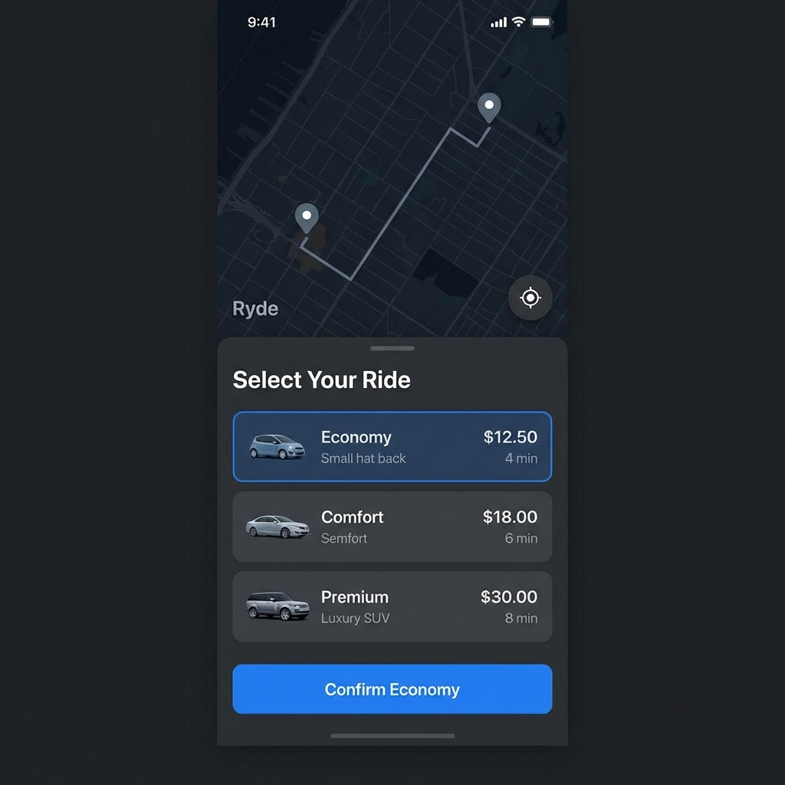

# Rydo


[](https://flutter.dev)
[](https://dart.dev)
[](https://developers.google.com/maps)
[](https://opensource.org/licenses/MIT)

**Rydo** is a next-generation ride-hailing application built with Flutter, designed to provide a seamless and premium travel experience. It integrates powerful geolocation services and real-time mapping to connect riders with drivers efficiently.

## 🌟 Key Features

*   **📍 Real-Time Tracking**: Watch your ride in real-time with smooth animations and accurate location updates.
*   **🗺️ Google Maps Integration**: Full-featured map interface with custom markers, polyline routing, and traffic layers.
*   **📱 Modern UI/UX**: A sleek, professional, and intuitive user interface crafted for ease of use.
*   **🔍 Smart Search**: Intelligent location search with autocomplete suggestions for pickup and drop-off.
*   **🛡️ Secure & Reliable**: Built with safety and reliability at its core.

## 📸 Screenshots

| Home Screen | Driver Details | Ride Selection |
|:-----------:|:--------------:|:--------------:|
|  |  |  |

> *Developer Note: Please upload your app screenshots to `assets/images/` and rename them to `screenshot_1.png`, `screenshot_2.png`, etc.*

## 🛠️ Tech Stack

*   **Framework**: [Flutter](https://flutter.dev/)
*   **Language**: [Dart](https://dart.dev/)
*   **Maps SDK**: [google_maps_flutter](https://pub.dev/packages/google_maps_flutter)
*   **Geolocation**: [geolocator](https://pub.dev/packages/geolocator)
*   **Geocoding**: [geocoding](https://pub.dev/packages/geocoding)

## 🚀 Getting Started

Follow these steps to run the project locally.

### Prerequisites

*   Flutter SDK installed
*   Android Studio / VS Code
*   Google Maps API Key

### Installation

1.  **Clone the repository**
    ```bash
    git clone https://github.com/Choudhary-Khuzaim/Rydo.git
    cd Rydo
    ```

2.  **Install dependencies**
    ```bash
    flutter pub get
    ```

3.  **Configure Maps API Key**
    *   **Android**: Add your key to `android/app/src/main/AndroidManifest.xml`
    *   **iOS**: Add your key to `ios/Runner/AppDelegate.swift`

4.  **Run the App**
    ```bash
    flutter run
    ```

## 🤝 Contributing

Contributions are welcome! Please fork the repository and submit a pull request.

## 📄 License

This project is licensed under the MIT License - see the [LICENSE](LICENSE) file for details.

---
© 2026 Rydo Project. Developed by [Your Name].
