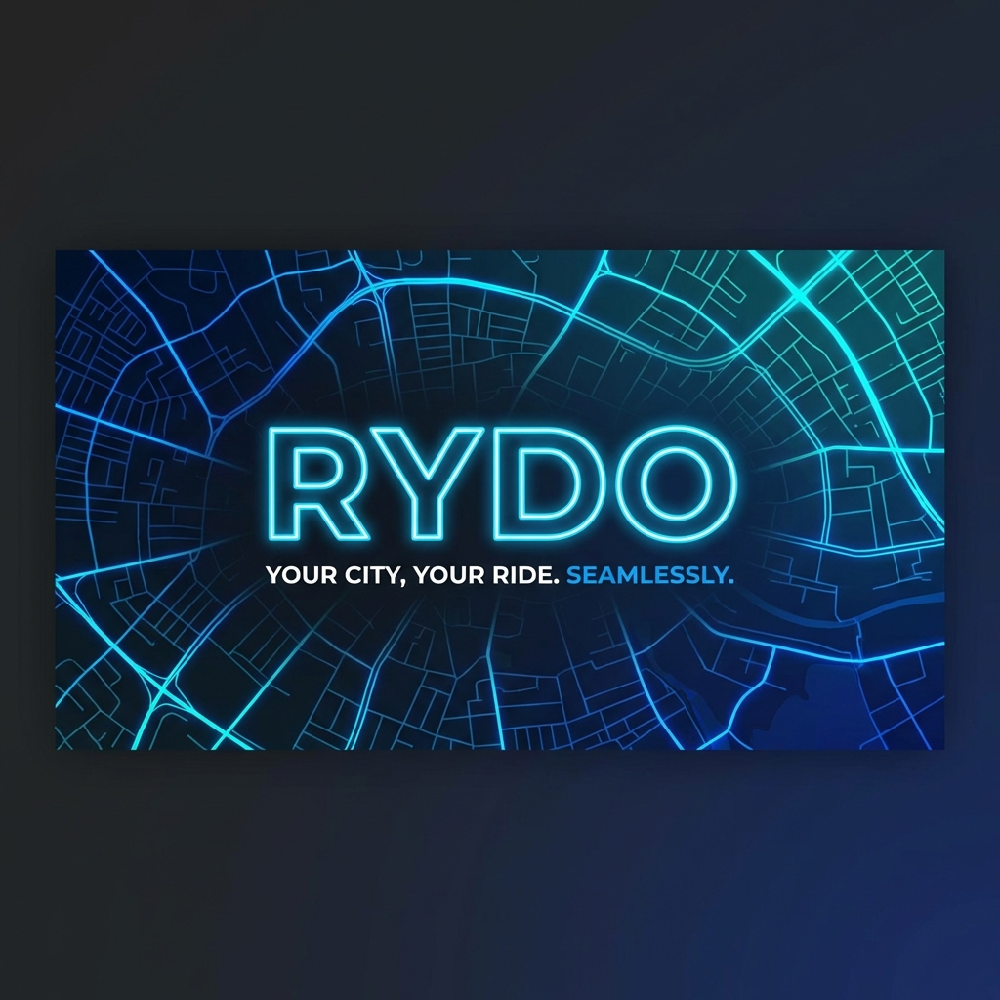

<a name="readme-top"></a>

<div align="center">
  <h1>🚕 RYDO</h1>
  <p><b>Rethinking the Ride-Hailing Experience.</b></p>

  

  <br />

  [](https://flutter.dev)
  [](https://dart.dev)
  [](https://www.openstreetmap.org/)
  [](https://en.wikipedia.org/wiki/Pakistani_rupee)

  <p align="center">
    A high-fidelity, open-source ride-booking template built to showcase what’s possible with modern Flutter development.
    <br />
    <br />
    <a href="https://github.com/Choudhary-Khuzaim/Rydo/issues">Report Bug</a>
    ·
    <a href="https://github.com/Choudhary-Khuzaim/Rydo/issues">Request Feature</a>
  </p>
</div>

---

## � The Vision Behind Rydo

Most ride-hailing templates focus on just the UI. With Rydo, I wanted to go a step further. This project isn't just about pretty screens—it’s about handling real-world logic: persistent navigation, live location-to-address conversion, and a fully localized financial ecosystem (PKR).

I've built this as a reference point for developers who want to see how to implement "premium" feel features like **Glassmorphism**, smooth **Sliver** interactions, and **OpenStreetMap** integration without the heavy costs of Google Maps APIs.

---

## 🆕 Major Updates (v1.2)

The app has recently undergone a major transformation to reach production-grade quality:

*   **Dynamic Theme Switching (Dark Mode)**: A full system-wide theme engine is now integrated. Users can switch between Light and Dark modes.
*   **Dual Map Engine**: The map now dynamically adjusts its tiles based on the theme: 
    *   **Light Mode**: Uses *CartoDB Voyager* for a clean, colorful look.
    *   **Dark Mode**: Uses *CartoDB Dark Matter*, providing a high-contrast, eye-friendly night experience.
*   **Real Road-Based Routing**: Replaced traditional "straight-line" navigation with real road data using the **OSRM (Open Source Routing Machine) API**. Your ride paths now follow actual streets.
*   **Premium Screen Overhaul**: Added and professionalized over 10+ new specialized screens including:
    *   **Appearance**: System-wide theme control.
    *   **Help Center**: Automated FAQ and support categories.
    *   **Chat Interface**: Real-time mock chat with drivers including quick-replies.
    *   **Favorites & Privacy**: Dedicated management for saved places and data policies.
*   **Safety & Prevention**: Implemented booking debouncing and state management to prevent double-bookings and navigation glitches.

---

## 🌟 Core Features

*   **🗺️ Maps & Geolocation**: Built on `flutter_map` (OpenStreetMap). It’s lightweight, fast, and completely free to use.
*   **🌓 Adaptive Theming**: Seamless transition between light and dark modes across all widgets and map tiles.
*   **🚗 Real-Path Routing**: Accurate ETA and road-following paths using OSRM engine.
*   **🎨 Glassmorphic UI**: High-end translucent effects on the floating search bar and bottom navigation.
*   **💰 Wallet Integration**: Full end-to-end flow localized in **PKR (Rs.)** for managing balances and tracking spending.
*   **⚡ Optimized Performance**: State is managed efficiently to ensure 60FPS map interactions even on mid-range devices.

---

## 🛠 Tech Stack

*   **Framework**: [Flutter](https://flutter.dev/) (Dart)
*   **Tile Servers**: [CartoDB](https://carto.com/basemaps/) (Voyager & Dark Matter)
*   **Routing Engine**: [OSRM](http://project-osrm.org/) (Open Source Routing Machine)
*   **Location Services**: [geolocator](https://pub.dev/packages/geolocator) & [geocoding](https://pub.dev/packages/geocoding)
*   **Icons**: [Cupertino Icons](https://pub.dev/packages/cupertino_icons) & Lucide-like custom icons

---

## 🚀 Getting Started

To get this up and running on your local machine:

1.  **Clone the Repository**
    ```sh
    git clone https://github.com/Choudhary-Khuzaim/Rydo.git
    ```
2.  **Bootstrap Dependencies**
    ```sh
    cd Rydo
    flutter pub get
    ```
3.  **Run with Hot Reload**
    ```sh
    flutter run
    ```

**Dev Note:** For Android builds, double-check that `INTERNET` and `ACCESS_FINE_LOCATION` permissions are enabled in your `AndroidManifest.xml` to allow map tiles and routing to work correctly.

---

## 🛣 Future Roadmap

- [ ] Firebase Auth & OTP Integration
- [ ] Real-time Driver Tracking via WebSockets
- [ ] Wallet Payment Gateway (Stripe/JazzCash integration)
- [ ] Driver-side dedicated dashboard
- [ ] Multi-language support (Urdu localization)

---

## 🤝 Community & Contributions

If you find this project helpful, give it a ⭐️! 

Got a bug report or a feature request? Open an issue. Want to contribute code? PRs are always welcome. I'm especially looking for help with refining the routing algorithms and state management.

---

## 📞 Connect with Me

**Khuzaim Sajjad** - Full Stack Developer
*   [GitHub](https://github.com/Choudhary-Khuzaim)
*   [LinkedIn](https://www.linkedin.com/in/khuzaimsajjad/)

---
<div align="center">
  <p>© 2026 Rydo Project. Thinking Forward. Moving Faster.</p>
</div>
